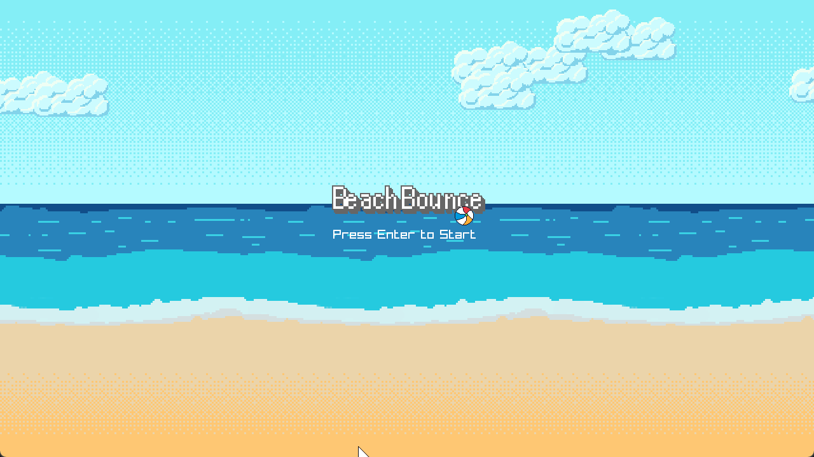
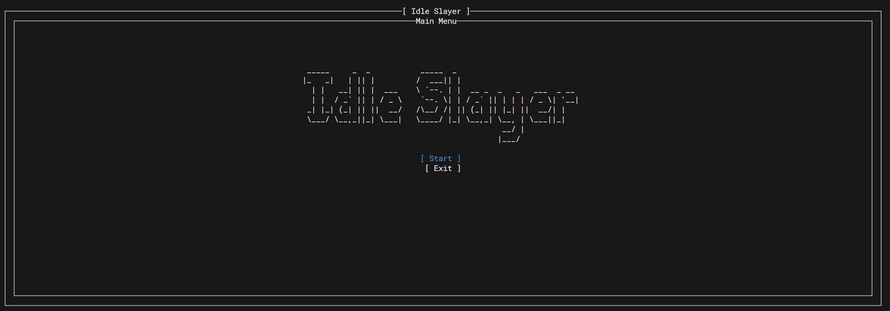

## Hello there 👋

My name is Josef Reichelt and I like to code things.  
Checkout my page at [josefreichelt.github.io/](https://josefreichelt.github.io/)  
I'm a web frontend developer with 5 years of working experience in **React** but my passion and focus is game development.  

Currently I enjoy exploring making games from scratch as much as possible with **C++**.  

What I love the most:

- My son 👦
- My wife 👱‍♀️
- Games 🕹
- Listening to movie and game OST 🎧
- Game development 💾

If you would like to contact me with a job offer, visit my [linkedin.com/in/josefreichelt](https://www.linkedin.com/in/josefreichelt/)

___

# Some things I worked on  

## Beach Plane

A simple flappy bird like plane game made with raylib and c++

[Playable version on itch.io](https://protomace.itch.io/beach-plane)

### Technologies used

- C++
- Raylib
- Raygui
- Emscripten

## Beach Bounce

A simple bouncy ball game made with raylib and c++

[Playable version on itch.io](https://protomace.itch.io/beach-bounce)

### Technologies used

- C++
- Raylib
- Emscripten

## IdleSlayer

A terminal based idle monster game made with c#

### Technologies used

- C#
- Terminal.Gui
